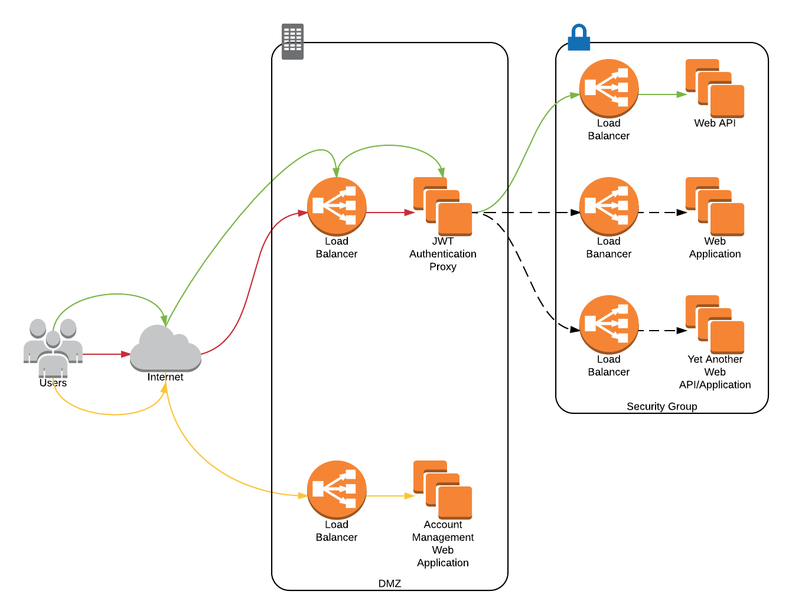

# JSON Web Token Authentication Proxy
JSON Web Token Authentication Proxy (jwtap, pronounced "jot app") is an HTTP reverse proxy that provides authentication
services, in concert with an external user authentication service, to both HTTP web applications and APIs. Jwtap is
implemented as Ruby that runs in the context of [Nginx](http://nginx.org/) + [ngx_mruby](http://ngx.mruby.org/) + [mruby-jwt](https://github.com/prevs-io/mruby-jwt).


# Unauthenticated Web API Request
1. (Red lines) Unauthenticated request, e.g. https://api.example.com/, returns a 401 Unauthorized
2. (Yellow lines) Client application navigates to the configured authentication web app providing a URL to redirect to,
   e.g. https://accounts.example.com/login/?nextUrl=https://spa.example.com/?id=12345
3. (Green lines) Upon successful login, redirect to provided URL, in this example https://spa.example.com/?id=12345

# Unauthenticated Server-Side Web Application Request
1. (Red lines) Unauthenticated request (a request without a JWT, with an expired JWT, or with an invalid JWT), e.g.
   https://app.example.com, returns a 302 Found
2. (Yellow lines) Redirects to the authentication web app providing a URL to redirect to, e.g.
   https://accounts.example.com/login/?nextUrl=https://app.example.com
3. (Green lines) Upon successful login, redirect to provided URL, in this example https://app.example.com

# Features
* Validates JWTs for both HTTP APIs and server-side web applications
* Enforces JWT expiration
* Returns 401 as appropriate for API requests
* Redirects clients to a configurable log in URL for web applications
  * Includes an URL to redirect to upon successful authentication
  * If a GET request, uses the originally requested URL
  * If a non-GET request, uses HTTP Referrer if available, otherwise uses a configured default URL
* Implements sliding expiration
* Supports JWTs in Authorization headers or session cookies

# nginx.conf
```
http {
  server {
    set $jwtap_cookie_domain example.com;
    
    # Optional; default is "jwt"
    set $jwtap_cookie_name jwt;
    
    # Optional; default is 1800
    set $jwtap_expiration_duration_seconds 1800;
    
    set $jwtap_login_url https://accounts.example.com/login/;

    # 256 bit secret key generated with openssl rand -base64 32
    set $jwtap_secret_key_base64 FB6PdPRhNHDDh2NhPlrmNytrMbmjMlgJlLkhrIBIvLk=;

    # A web API location.
    location /api/ {
      mruby_access_handler /fully-qualified-path-to/jwtap.rb cache;
      proxy_pass https://api.example.net/;
    }

    # A server-side web application location.
    location /application/ {
      # Proxied locations by default are APIs.
      set $jwtap_proxy_type application;

      # Specify a default URL to redirect to from the login web app in case the request is not a GET and a Referer [sic]
      # header has not been provided.
      set $jwtap_default_next_url https://example.com/application/;

      mruby_access_handler /fully-qualified-path-to/jwtap.rb cache;
      proxy_pass https://application.example.net/;
    }
  }
}
```

# Try It Out!
On OS X, jwtap can be installed using a _draft_ [Homebrew formula](https://github.com/dinosaurjr10/homebrew-tap/blob/master/jwtap.rb)
(draft because it does not have all the bells and whistles of most formulas).
```
brew update
brew tap dinosaurjr10/tap
brew install jwtap
```
Once installed, edit `nginx.conf` using the above example as a guide.

# Hack on It!
Most of these scripts only change things local to the project; however, `bin/install_ngx_mruby.sh` will install OpenSSL
via Homebrew. Please read the scripts before running them.
```
git clone https://github.com/dinosaurjr10/jwtap.git
bin/install_ngx_mruby.sh
source .env.test
bin/generate_conf.rb
bin/nginx.sh
```
Jwtap is now accessible via `https://localhost:8765/`. A faux API is available via `https://localhost:8765/test-api/`, and
a faux application is available via `https://localhost:8765/test-application/`. At this point requesting `/test-api/`
will return a 401, and requesting `/test-application/` will redirect to a pseudo log in page. By requesting
`https://localhost:8765/set-cookie/` and then requesting the API or application location, a "Hello, proxy World!" page is
returned. Request `https://locaion:8765/delete-cookie/` to delete the cookie.

# Package It!
`rpmbuild/SPECS/jwtap.spec` defines a CentOS RPM spec file. It can be developed and tested on a macOS host using the
following scripts (please read these scripts before running them):
```
bin/setup.sh
bin/buildrpm.sh
bin/installrpm.sh
```
`Vagrantfile` forwards port 80 on the `test` VM to port 8765 on the host OS. Starting `jwtap` on the `test` VM via
`sudo service jwtap start` will make it accessible on these ports.

# References
* [jwt.io](https://jwt.io/)
* [RFC 7519 JSON Web Tokens](https://tools.ietf.org/html/rfc7519)
* [RFC 6750 The OAuth 2.0 Authorization Framework: Bearer Token Usage, Section 2.1 Authorization Request Header Field](https://tools.ietf.org/html/rfc6750#section-2.1)
* [RFC 6750 The OAuth 2.0 Authorization Framework: Bearer Token Usage, Section 3 The WWW-Authenticate Response Header Field](https://tools.ietf.org/html/rfc6750#section-3)
* [RFC 6265 HTTP State Management Mechanism (Cookies)](https://tools.ietf.org/html/rfc6265)
* [RFC 7231 Hypertext Transfer Protocol (HTTP/1.1): Semantics and Content, Section 5.2.2 Referer [sic]](https://tools.ietf.org/html/rfc7231#section-5.5.2)
* [RFC 7231 Hypertext Transfer Protocol (HTTP/1.1): Semantics and Content, Section 7.1.2 Location](https://tools.ietf.org/html/rfc7231#section-7.1.2)
